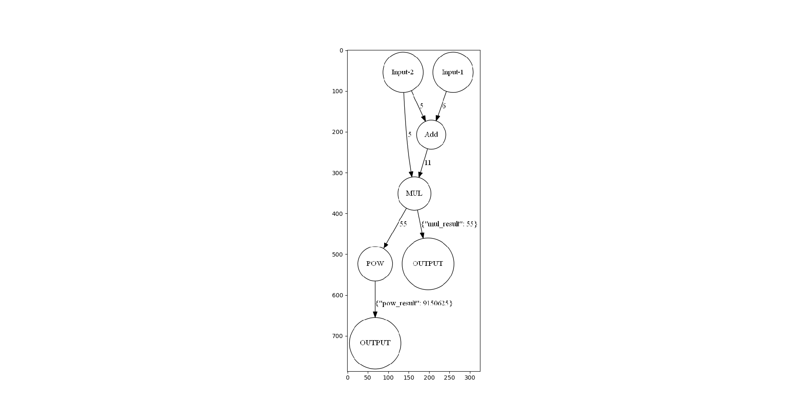

 # elcflow
 
 [](https://travis-ci.com/eggachecat/elc-flow-engine)
 [](https://badge.fury.io/py/elc-flow)
 [](https://coveralls.io/github/eggachecat/elc-flow-engine)
 [](https://elc-flow-engine.readthedocs.io/en/latest/?badge=latest)

 
 ## 介绍
 ELC使用
  
 ## 指令
 ### 生成文档
  > cd docs && sphinx-apidoc -o source ../elcflow/ && make html  
 ### 测试
  > pytest --cov=elcflow
  
 ## 使用
 ### 注册算子
 使用`register_elc_function`来注册是一个算子,算子包含以下属性:
 - name
    - 唯一的标识符,用来找到这个算子
 - outputs
    - list
    - 给输出取名字(在图上徐)
    - 对应到是节点输出的id
 - inputs
    - 不可选, 则使用函数中定义的名称
    - 对应到是节点输入的id
 - parameters
    - 字典类型, 包含了默认的参数
    - 主要适用于例如指数函数,其指数当作参数
        - 给指数2 -> 平方
 ### 用例
```python
@register_elc_function(outputs=['elc_output'], name='elc_exp_and_plus', parameters={'x': 5})
# 一个例子
# 表明注册了一个名称为elc_exp_and_plus算子
# 他的输入有[a,b,x]
# 其中x是参数给的默认值是5
# 它输出的名字叫做elc_output
def elc_exp_and_plus_(a, b, x=2):
    return a ** x + b ** x
```

### 图
#### 数据结构
图主要由以下两部分组成
- nodes
    - 包含了所有的节点的信息
    - id
    - label
    - 类型
        - 数据类型
        - 算子类型
    - 其他
        - 例如算子的参数
- edges
    - 有方向的边,从一个node的*某一个输出*数据流向另一个node的*某一个输入*
    - id
    - source
        - 起始节点的id
    - target
        - 结束节点的id
    - _elc_source_output_id
        - 起始节点输出的id
            - 可能有多个输出, 取哪一个?
    - __elc_target_input_id
        - 结束节点输入的id
            - 可能有多个输入, 对应到哪一个?
#### 例子      
```python
from elcflow.graph import *
from elcflow.graph import *
from elcflow.helpers import json_stringify, json_parse

json_model = {
    "nodes": [
        {"label": "Input-2", "id": "3362b879", "_elc_node_type": 'data'},
        {"label": "Input-1", "id": "0ea5a129", "_elc_node_type": 'data'},
        {"label": "Add", "id": "8ac87236", "_elc_node_type": 'operator', "_elc_function": "elc_add"},
        {"label": "MUL", "id": "0d1af6ff", "_elc_node_type": 'operator', "_elc_function": "elc_mul"},
        {"label": "POW", "id": "9d1af6ff", "_elc_node_type": 'operator', "_elc_function": "elc_pow", "_elc_parameters": {"a": 4}},
        {"label": "OUTPUT", "id": "1d1af6ff", "_elc_node_type": 'operator', "_elc_function": "elc_output", },
        {"label": "OUTPUT", "id": "2d1af6ff", "_elc_node_type": 'operator', "_elc_function": "elc_output"},
    ],
    "edges": [
        {"source": "0ea5a129", "target": "8ac87236", "id": "74bc97ca", "_elc_source_output_id": '', "_elc_target_input_id": "a"},
        {"source": "3362b879", "target": "8ac87236", "id": "d3645364", "_elc_source_output_id": '', "_elc_target_input_id": "b"},
        {"source": "8ac87236", "target": "0d1af6ff", "id": "b0eb9a9b", "_elc_source_output_id": 'sum_result', "_elc_target_input_id": "a"},
        {"source": "3362b879", "target": "0d1af6ff", "id": "0e6c0fde", "_elc_source_output_id": '', "_elc_target_input_id": "b"},
        {"source": "0d1af6ff", "target": "9d1af6ff", "id": "7e6c0fde", "_elc_source_output_id": 'mul_result', "_elc_target_input_id": "x"},
        {"source": "0d1af6ff", "target": "1d1af6ff", "id": "1e6c0fde", "_elc_target_input_id": "kwargs"},
        {"source": "9d1af6ff", "target": "2d1af6ff", "id": "2e6c0fde", "_elc_target_input_id": "kwargs"},
    ]
}
# 从json结构parse成图
_graph = ELCGraph.create_from_elc_json(json_model)
# 编译图: 包含了对于节点拓扑排序并且初始化的工作
_graph.compile()
# 把输入节点的数据喂进去
_graph.feed_data_dict({
    '3362b879': 5,
    '0ea5a129': 6
})
# 执行图
_graph.execute()
# 序列化整个图结构
graph_str = json_stringify(_graph.to_dict())
# 解析序列化结构到图
new_graph = ELCGraph.load(json_parse(graph_str))
# 把结果画出来
new_graph.plot(show=True, with_state=True)
```

